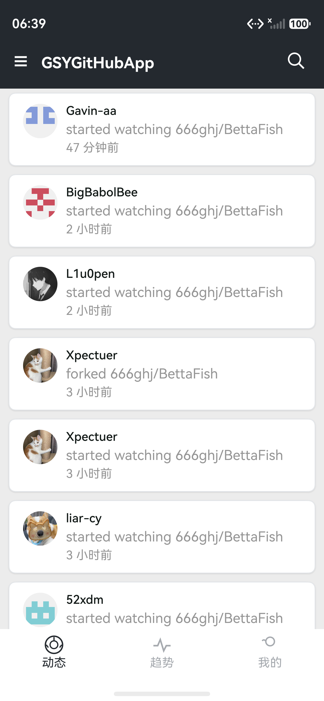
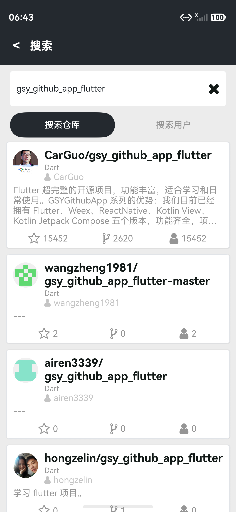
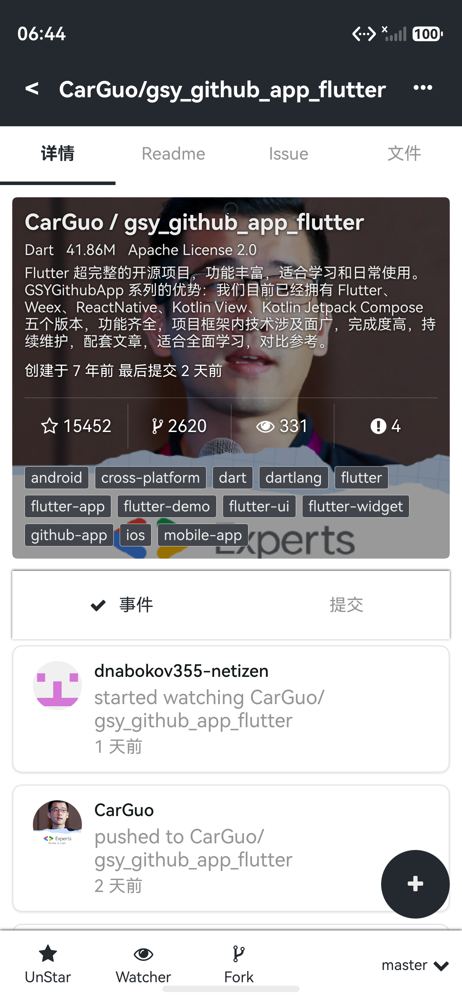

# GSYGithubAppOH

## 一款 HarmonyOS ArkUI 原生的开源 GitHub 客户端 App

基于 HarmonyOS ArkUI / Stage Model 开发，功能与 UI 以
[Android Compose 版 GSYGithubAPPCompose](https://github.com/CarGuo/GSYGithubAPPCompose)
为主要对齐目标，覆盖 GitHub 动态、趋势、搜索、仓库详情、Issue、Push、代码浏览、通知、历史、本地缓存、Token 登录和 OAuth WebView 授权登录等场景。

* ### 同款 Android Compose 版 （ https://github.com/CarGuo/GSYGithubAPPCompose ）
* ### 同款 Compose Multiplatform 版 （ https://github.com/CarGuo/GSYGithubAppCMP ）
* ### 同款 Flutter 版 （ https://github.com/CarGuo/gsy_github_app_flutter ）
* ### 同款 Kotlin View 版 （ https://github.com/CarGuo/GSYGithubAppKotlin ）
* ### 同款 ReactNative 版 （ https://github.com/CarGuo/GSYGithubApp ）
* ### 同款 Weex / uni-app 版 （ https://github.com/CarGuo/GSYGithubAppWeex ）

```
项目目标是方便个人日常维护和查阅 GitHub，同时适合 HarmonyOS ArkUI 练手学习。

当前版本以 GSYGithubAPPCompose 为功能、页面和交互验收标准；React Native 版只作为历史参考。
```

## 启动演示


## 界面截图

| Dynamic | Search |
| --- | --- |
|  |  |

| Repository Detail | Code Detail |
| --- | --- |
|  |  |

## 编译运行流程

### 环境要求

- DevEco Studio
- HarmonyOS SDK `6.1.0(23)` 或项目当前配置兼容版本
- Node / hvigor 使用 DevEco Studio 自带版本即可
- bundleName：`cn.gsy.githubapp`
- OAuth callback：`gsygithubapp://authed`

### 一次性签名

HarmonyOS 没有 Android 那种全平台通用 debug keystore。每个开发者都需要用自己的华为开发者账号生成签名材料。

1. 用 DevEco Studio 打开本工程目录。
2. 打开 **File -> Project Structure -> Project -> Signing Configs**，选中 `default`。
3. `Bundle name` 填 `cn.gsy.githubapp`，或改成你自己的 bundleName 并同步修改 [AppScope/app.json5](./AppScope/app.json5)。
4. 勾选 **Automatically generate signature**，登录华为开发者账号后确认。
5. DevEco 会在本机生成 `.p12 / .csr / .cer / .p7b` 等签名材料，并写入 [build-profile.json5](./build-profile.json5)。

### 配置 GitHub OAuth

Token 登录不需要额外配置。若要使用 WebView OAuth 授权登录，需要先在 GitHub 创建 OAuth App：

[注册 GitHub OAuth App](https://github.com/settings/applications/new)

Authorization callback URL 填：

```text
gsygithubapp://authed
```

然后复制本地配置模板：

```sh
cp entry/src/main/resources/rawfile/oauth.local.example.json \
  entry/src/main/resources/rawfile/oauth.local.json
```

把 `oauth.local.json` 改成自己的值：

```json
{
  "client_id": "YOUR_GITHUB_OAUTH_CLIENT_ID",
  "client_secret": "YOUR_GITHUB_OAUTH_CLIENT_SECRET",
  "redirect_uri": "gsygithubapp://authed"
}
```

`oauth.local.json` 已被 [.gitignore](./.gitignore) 忽略，不会入库。

### 运行

- 模拟器：DevEco Studio 顶部选择 HarmonyOS Emulator，运行 `entry`。
- 真机：连接设备并完成签名配置后，运行 `entry`。

命令行打包：

```sh
export DEVECO_HOME="<DevEco Studio Contents path>"
source scripts/env.sh
hvigorw assembleHap --mode module -p product=default -p buildMode=debug --no-daemon
```

### 测试

```sh
chmod +x harness/regression/run-tests.sh
./harness/regression/run-tests.sh
```

页面回归脚本：

```sh
chmod +x scripts/scenario-tour.sh
./scripts/scenario-tour.sh
```

测试报告和录屏属于本地回归产物，默认不提交。

## 项目结构

```
GSYGithubAppOH/
├── AppScope/                     # 应用级配置
├── entry/                        # entry HAP
│   └── src/main/
│       ├── ets/
│       │   ├── pages/            # ArkUI 页面
│       │   ├── common/           # 通用组件
│       │   ├── widget/           # 业务组件
│       │   ├── auth/             # Token / OAuth 登录
│       │   ├── dao/              # 数据访问与 RDB
│       │   ├── service/          # GitHub 数据服务
│       │   ├── store/            # 页面状态
│       │   ├── navigation/       # 路由
│       │   ├── style/            # 颜色、字号、间距
│       │   ├── i18n/             # 多语言
│       │   └── utils/            # 工具方法
│       └── resources/            # 资源、字体、本地 OAuth 模板
├── docs/                         # README 展示资源
├── harness/                      # 回归记录、测试策略、架构文档
├── scripts/                      # 自动回归脚本
└── build-profile.json5
```

## 核心能力

- Compose 对齐：Welcome、Login、Home、Search、RepositoryDetail、IssueDetail、PushDetail、CodeDetail、User/Profile、Notification、History。
- 本地缓存：RDB 表用于仓库、README、提交、用户、动态、历史等数据的先读缓存、再网络更新。
- 登录：Personal Access Token 登录、OAuth WebView 登录、`gsygithubapp://authed` 深链回调。
- Web/Markdown：README 和代码详情按 GitHub 内容类型走 WebView 或 ArkUI 文本兜底。
- 自动回归：稳定控件 id、启动参数、scenario tour、Hypium 组件测试。

## 文档入口

- Compose 对照记录：[harness/regression/compose-parity/INDEX.md](./harness/regression/compose-parity/INDEX.md)
- 架构总览：[harness/architecture/overview.md](./harness/architecture/overview.md)
- 测试策略：[harness/testing/strategy.md](./harness/testing/strategy.md)

## 开源协议

本项目基于 [MIT License](./LICENSE) 开源。
